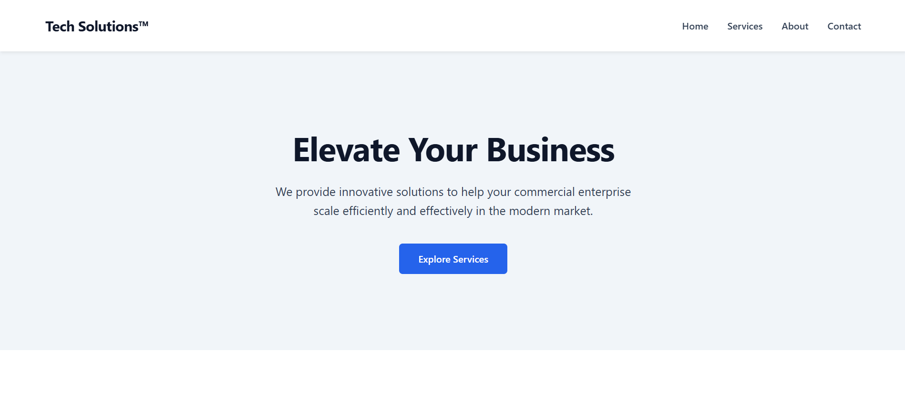

# Ex02 Commercial Website
## Date: 24/02/2026

## AIM
To create a commercial website using CSS Flexbox.

## ALGORITHM
### STEP 1
Create an HTML file (index.html)

### STEP 2
Create a CSS file (style.css)

### STEP 3
Include a navigation bar with links to different sections.

### STEP 4
Add structured sections for Homepage, Products / Services, About Us, Contact Details and User Account.

### STEP 5
Include social media links at the footer with copyright information.

### STEP 6
Define global styles for fonts, colors, and layout.

### STEP 7
Style the header, navigation bar, and sections.

### STEP 8
Use Flexbox for layout design.

### STEP 9
Add hover effects and transitions for interactivity.

### STEP 10
Add Images and Media.

### STEP 11
Use optimized images for a professional look.

### STEP 12
Open the HTML file in a browser to check layout and functionality.

### STEP 13
Fix styling issues and refine content placement.

### STEP 14
Deploy the website.

### STEP 15
Upload to GitHub Pages for free hosting.

## PROGRAM
### index.html
```html
<!DOCTYPE html>
<html lang="en">
<head>
    <meta charset="UTF-8">
    <meta name="viewport" content="width=device-width, initial-scale=1.0">
    <title>Professional Commercial Website</title>
    <link rel="stylesheet" href="style.css">
</head>
<body>

    <header>
        <div class="logo">Tech Solutions&trade;</div>
        <ul class="nav-links">
            <li><a href="#home">Home</a></li>
            <li><a href="#services">Services</a></li>
            <li><a href="#about">About</a></li>
            <li><a href="#contact">Contact</a></li>
        </ul>
    </header>

    <section class="hero" id="home">
        <h1>Elevate Your Business</h1>
        <p>We provide innovative solutions to help your commercial enterprise scale efficiently and effectively in the modern market.</p>
        <a href="#services" class="btn">Explore Services</a>
    </section>

    <section class="services" id="services">
        <h2 class="section-title">What We Offer</h2>
        <div class="grid">
            <div class="card">
                <h3>Strategic Consulting</h3>
                <p>Expert guidance to navigate complex market dynamics and optimize your operational efficiency.</p>
            </div>
            <div class="card">
                <h3>Digital Transformation</h3>
                <p>Modernize your infrastructure with cutting-edge technologies tailored to your specific industry needs.</p>
            </div>
            <div class="card">
                <h3>Market Analytics</h3>
                <p>Data-driven insights that empower you to make informed decisions and stay ahead of the competition.</p>
            </div>
        </div>
    </section>

    <footer>
        <div class="footer-content">
            <h2>Tech Solutions&trade;</h2>
            <p style="color: #94a3b8; margin-top: 10px;">Building the future of commerce.</p>
        </div>
        
        <div class="student-info">
            <p>Designed by: <strong>YUVAN SUNDAR S</strong></p>
            <p>Register Number: <strong>212223040250</strong></p>
        </div>
    </footer>

</body>
</html>
```

### Style.css

```css
* {
    margin: 0;
    padding: 0;
    box-sizing: border-box;
    font-family: 'Inter', -apple-system, BlinkMacSystemFont, "Segoe UI", Roboto, Helvetica, Arial, sans-serif;
}

:root {
    --primary-color: #2563eb; 
    --primary-hover: #1d4ed8;
    --text-main: #334155; 
    --text-heading: #0f172a; 
    --bg-light: #f8fafc; 
    --bg-white: #ffffff;
}

body {
    background-color: var(--bg-white);
    color: var(--text-main);
    line-height: 1.6;
}

a {
    text-decoration: none;
    color: inherit;
}

header {
    display: flex;
    justify-content: space-between;
    align-items: center;
    padding: 1.5rem 5%;
    background-color: var(--bg-white);
    box-shadow: 0 4px 6px -1px rgba(0, 0, 0, 0.05), 0 2px 4px -1px rgba(0, 0, 0, 0.03);
    position: sticky;
    top: 0;
    z-index: 100;
}

.logo {
    font-size: 1.5rem;
    font-weight: 700;
    color: var(--text-heading);
    letter-spacing: -0.5px;
}

.nav-links {
    display: flex;
    gap: 2rem;
    list-style: none;
}

.nav-links a {
    font-weight: 500;
    transition: color 0.3s ease;
}

.nav-links a:hover {
    color: var(--primary-color);
}

.hero {
    text-align: center;
    padding: 8rem 5%;
    background-color: #f1f5f9; 
}

.hero h1 {
    font-size: 3.5rem;
    color: var(--text-heading);
    margin-bottom: 1.5rem;
    letter-spacing: -1px;
    line-height: 1.2;
}

.hero p {
    font-size: 1.25rem;
    max-width: 600px;
    margin: 0 auto 2.5rem auto;
    color: var(--text-main);
}

.btn {
    display: inline-block;
    background-color: var(--primary-color);
    color: white;
    padding: 0.8rem 2rem;
    border-radius: 6px;
    font-weight: 600;
    transition: background-color 0.3s ease;
}

.btn:hover {
    background-color: var(--primary-hover);
}

.services {
    padding: 6rem 5%;
}

.section-title {
    text-align: center;
    font-size: 2rem;
    color: var(--text-heading);
    margin-bottom: 3rem;
}

.grid {
    display: grid;
    grid-template-columns: repeat(auto-fit, minmax(300px, 1fr));
    gap: 2rem;
    max-width: 1200px;
    margin: 0 auto;
}

.card {
    background-color: var(--bg-white);
    padding: 2.5rem;
    border-radius: 8px;
    border: 1px solid #e2e8f0;
    text-align: left;
    transition: transform 0.3s ease, box-shadow 0.3s ease;
}

.card:hover {
    transform: translateY(-5px);
    box-shadow: 0 10px 25px rgba(0,0,0,0.05);
}

.card h3 {
    font-size: 1.25rem;
    color: var(--text-heading);
    margin-bottom: 1rem;
}

footer {
    background-color: var(--text-heading);
    color: #f8fafc;
    text-align: center;
    padding: 3rem 5%;
    margin-top: auto;
}

.footer-content {
    margin-bottom: 1rem;
}

.student-info {
    font-size: 0.9rem;
    color: #94a3b8; 
    border-top: 1px solid #334155;
    padding-top: 1rem;
    margin-top: 2rem;
    max-width: 400px;
    margin-left: auto;
    margin-right: auto;
}
```

## OUTPUT



## RESULT
The program for creating commercial website using CSS Flexbox is executed successfully.
